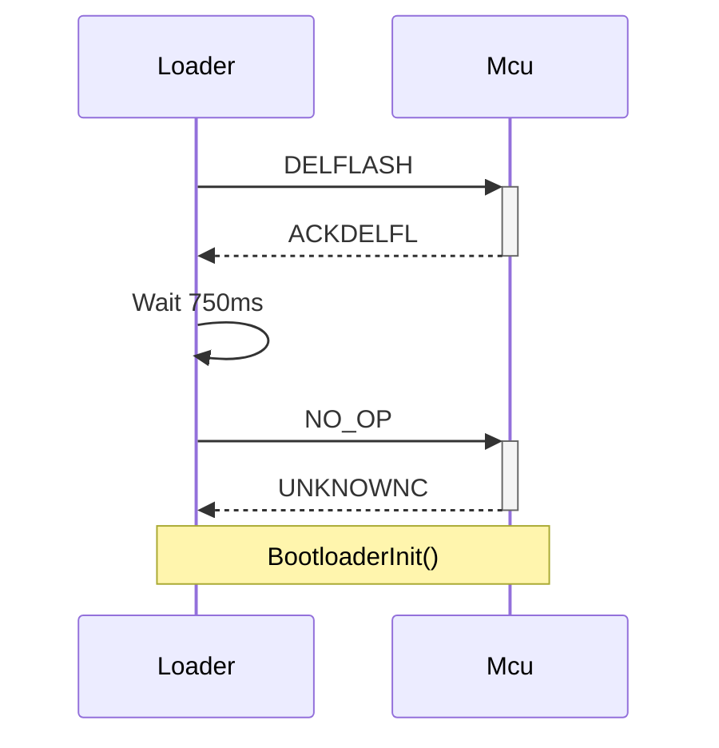
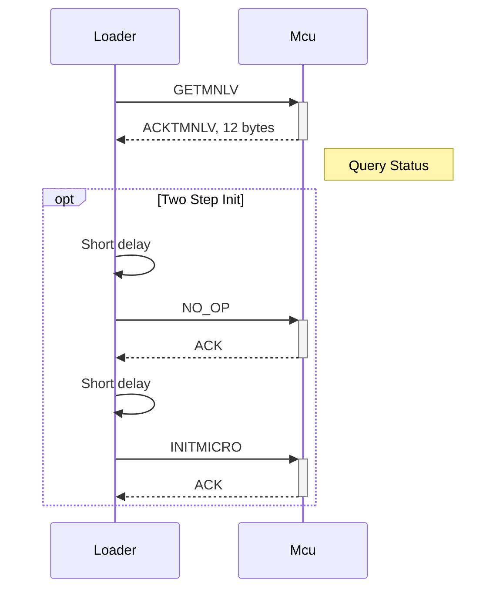
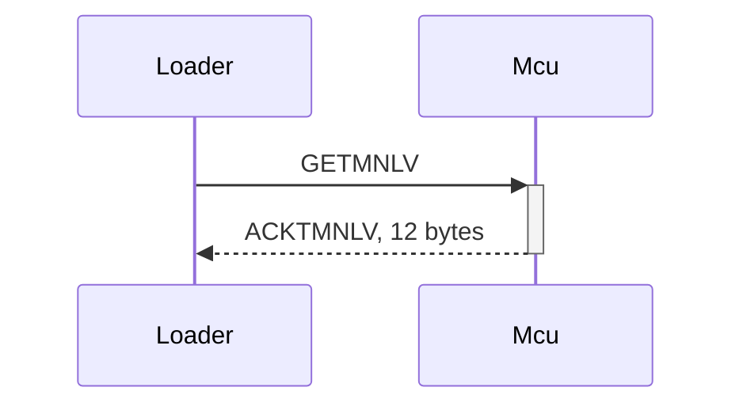
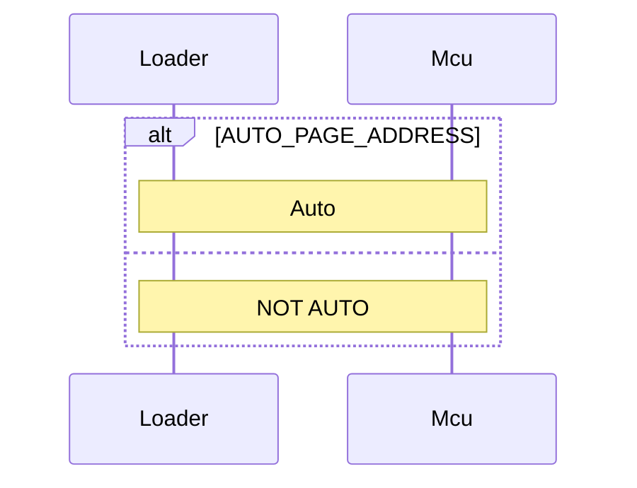
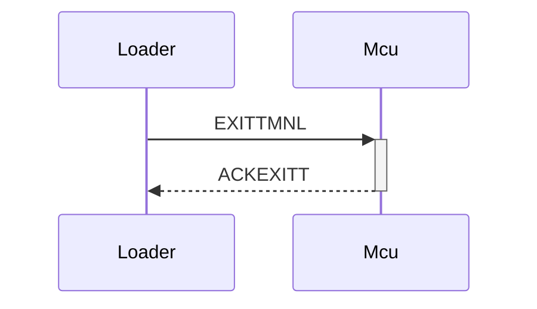

# Timonel Protocol

## Summary
These are notes to assist implementation; they are not definitive.

| Command  | T0 | T1       | T2       |    | R0 | R1                 | R2 | 
|----------|----|----------|----------|----|----|--------------------|----|
| NO_OP    | 00 |          |          |    | FF |                    |    |
| RESETMCU | 80 |          |          |    | 7F |                    |    |
| INITSOFT | 81 |          |          |    | 7E |                    |    |
| GETTMNLV | 82 |          |          |    | 7D | Data*12            |    |
| DELFLASH | 83 |          |          |    | 7C |                    |    |
| STPGADDR | 84 | Page MSB | Page LSB | CHK? | 7B |CHK(T1,T2) |
| WRITPAGE | 85 | Addr LSB | Addr MSB | Byte* | 7A | CHK(T1,T2,Byte*) | ???
| EXITTMNL | 86 | -        |          |    | 79 |
| READFLSH | 87 | Addr MSB | Addr LSB | Len | 78 | Byte* | CHK(T1,T2,Byte*) |
| READDEVS | 88 | -  |    |   | 76 | Flags (10 bytes) |
| WRITEEPR | 89 | Addr MSB | Addr LSB | Byte | 75 | CHK(T1, T2, Byte)
| READEEPR | 8A | Addr MSB | Addr LSB | - | 74 | Byte | CHK(T1, T2, Byte)| 

## Sequence diagrams

I'm using mermaid for sequence diagrams. These are not processed natively by GitHub, so if you see no pictures below, try installed a browser extension such as "Github + Mermaid".

### DeleteApplication()

### BootloaderInit()

### QueryStatus()

### UploadApplication(payload[], payload_size, uint16_t start_address)

### RunApplication()

## To add:

Try/Retry count for each command
Delay after command (after failure or success?)
Why STPGADDR has different byte order?

# See also
| URL | Comments |
|-----|----------|
| https://github.com/casanovg/Nb_TimonelTwiM/ | Sample uploader code |
| https://github.com/casanovg/nb-twi-cmd/blob/master/extras/Nicebots-Pluggie-I2C-Commands.xlsx | Command summary |
| https://github.com/casanovg/timonel/discussions/28 | Discussion thread |