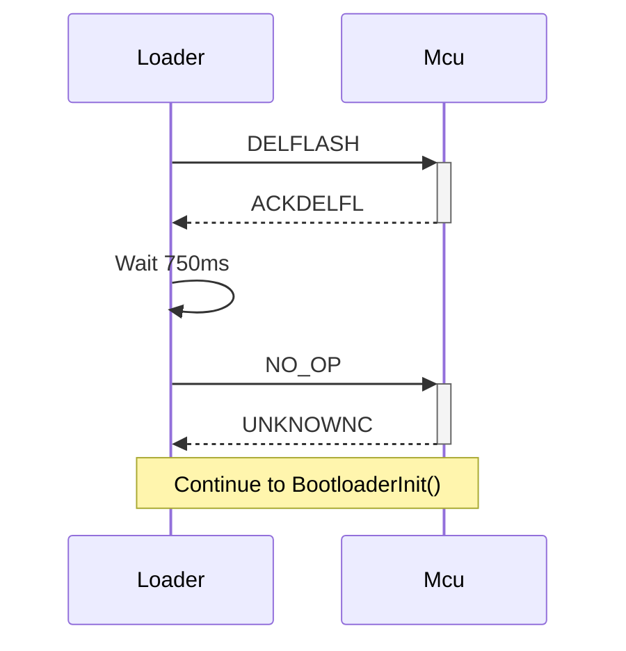
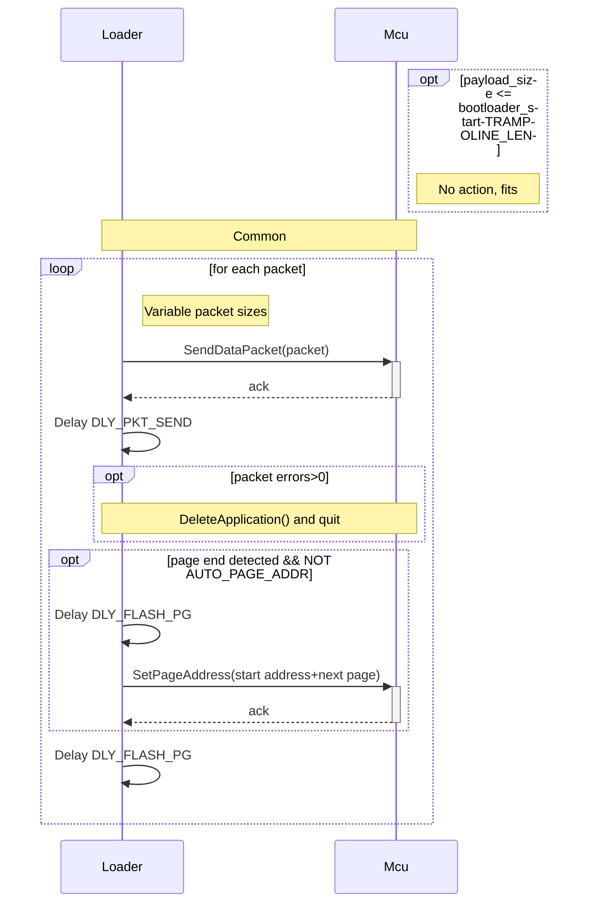
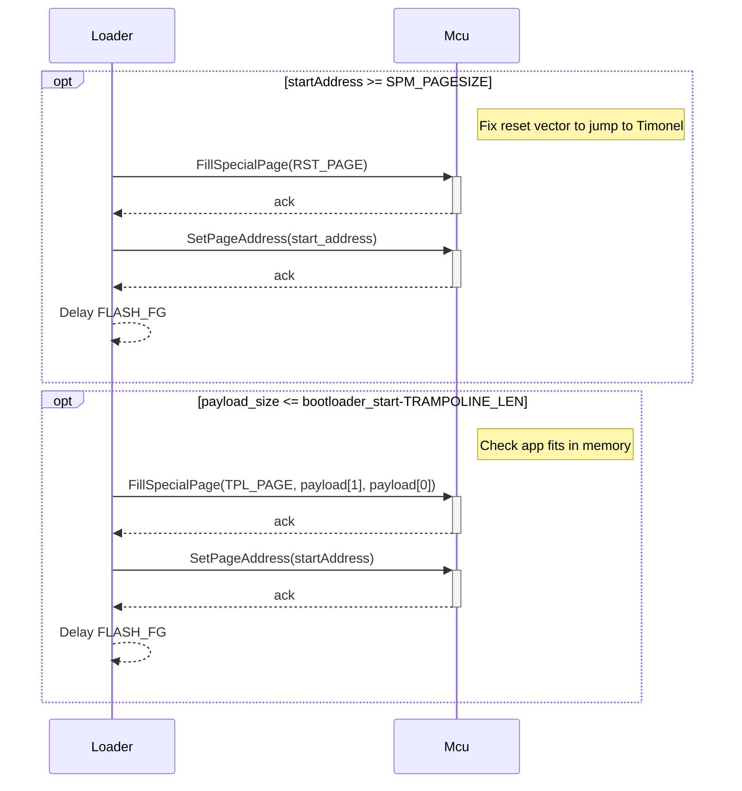
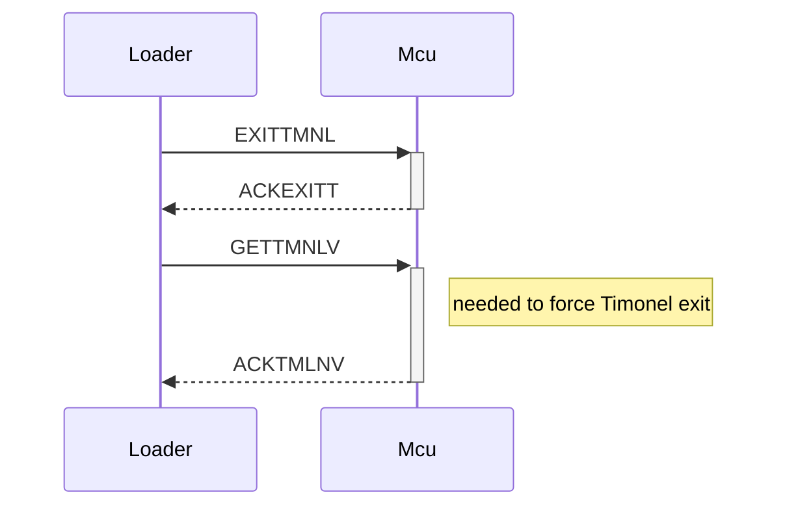

# Timonel Protocol

## Summary
These are notes to assist implementation; they are not definitive.

From version 1.6 onwards all word addresses are little-endian so the first byte of a two-bye address is is the LSB (Discussed within thread https://github.com/casanovg/timonel/discussions/28)

| Command  | T0 | T1       | T2       |      | R0 | R1                 | R2 | 
|----------|----|----------|----------|------|----|--------------------|----|
| NO_OP    | 00 |          |          |      | FF |                    |    |
| RESETMCU | 80 |          |          |      | 7F |                    |    |
| INITSOFT | 81 |          |          |      | 7E |                    |    |
| GETTMNLV | 82 |          |          |      | 7D | Data*12            |    |
| DELFLASH | 83 |          |          |      | 7C |                    |    |
| STPGADDR | 84 | Page LSB | Page MSB | CHK? | 7B | CHK(T1,T2)         |
| WRITPAGE | 85 | Addr LSB | Addr MSB | Byte*| 7A | CHK(T1,T2,Byte*)   | ???
| EXITTMNL | 86 | -        |          |      | 79 |
| READFLSH | 87 | Addr LSB | Addr MSB | Len  | 78 | Byte*              | CHK(T1,T2,Byte*) |
| READDEVS | 88 | -        |          |      | 76 | Flags (10 bytes) |
| WRITEEPR | 89 | Addr LSB | Addr MSB | Byte | 75 | CHK(T1, T2, Byte) |
| READEEPR | 8A | Addr LSB | Addr MSB | -    | 74 | Byte | CHK(T1, T2, Byte)| 

## Sequence diagrams

I'm using mermaid for sequence diagrams. These are not processed natively by GitHub, so if you see no pictures below, try installed a browser extension such as "Github + Mermaid".

### DeleteApplication()
Delete user application

### BootloaderInit()

### QueryStatus()

### UploadApplication(payload[], payload_size, uint16_t start_address)
Upload payload to MCU running Timonel

If AUTO_PAGE_ADDR is enabled, bootloader calculates addresses

If AUTO_PAGE_ADDR is disabled, loader calculates pages addresses.
Features must have F_AUTO_PAGE_ADDR

### RunApplication()

## To add:

Try/Retry count for each command
Delay after command (after failure or success?)

# See also
| URL | Comments |
|-----|----------|
| https://github.com/casanovg/Nb_TimonelTwiM/ | Sample uploader code |
| https://github.com/casanovg/nb-twi-cmd/blob/master/extras/Nicebots-Pluggie-I2C-Commands.xlsx | Command summary |
